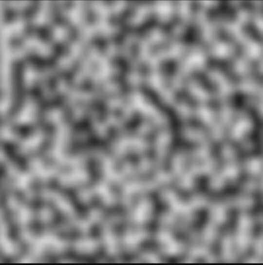
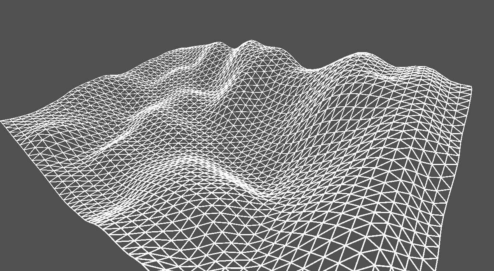

<h1>Générateur dynamique de terrain développé avec Unity</h1>

  
  

Réalisation du projet grâce à un <a href="https://www.youtube.com/watch?v=cNY2s5Kq9lE&list=PLUWxWDlz8PYLIG5w43tcZdaglQgXAQIPs" target="_blank">tutoriel vidéo de génération procédurale</a>.

Utilisation du <a href="https://fr.wikipedia.org/wiki/Bruit_de_Perlin" target="_blank">Bruit de Perlin</a> pour créer un générateur procédural de terrain.

Divisions du terrain généré en vertices pour lui donner du volume.

